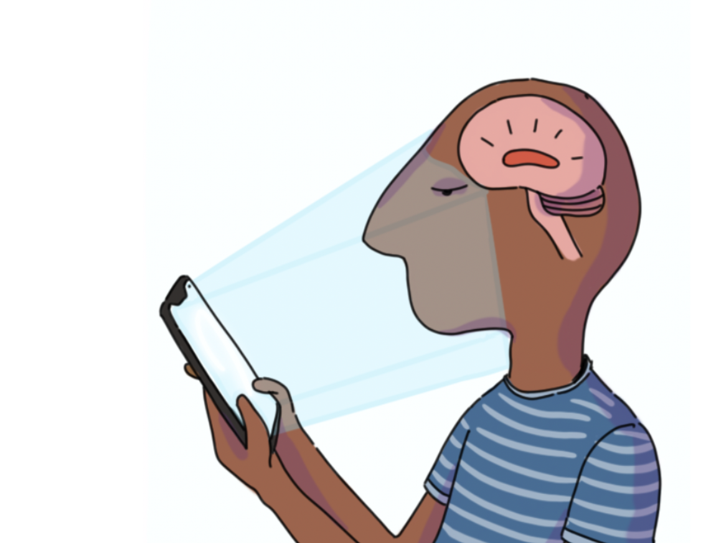

### About

### Citing

### License

The Light Exposure Behaviour Assessment (LEBA) instrument is released under the [CC-BY-NC-SA (Creative Commons Attribution-NonCommercial-ShareAlike 4.0) International License](https://creativecommons.org/licenses/by-nc-sa/4.0/).

### Contributing and translations

We welcome translations of the LEBA instrument, under the conditions of the CC-BY-NC-SA license.

### List of publications using the LEBA instrument
